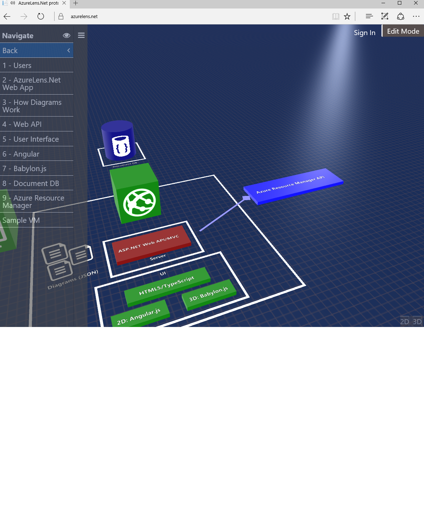

# AzureLens
AzureLens is an open source project for visualizing and designing the architecture of Azure solutions. You can see how the project is becoming alive by looking at http://www.azurelens.net

AzureLens has 3 specific goals:

1: <b>Be a place where we can "brainstorm", sketch and share architectural views of Azure based solutions.</b> This includes 3D and 2D views and the ability of calling AzureLens from simply hyperlinks, like the "View with AzureLens" button at the top of this Read Me page.

2: <b>Be a place where you can design, deploy and manage a template for Azure Resource Manager.</b> Here we aim to be able to translate that draft view of an architecture into real, living thing. This includes both being able to deploy solutions but also being able to operate on them from the visual objects on AzureLens

3: <b>Be a place where you can monitor what is happening with your system on Azure at a glance</b>. Here we are "binding" the visual objects to real Azure resources and setting up rules about which indicators trigger which visual cues in the diagram to change (color, text, size, etc).

#Sharing/Calling your own diagram:

The project is in initial stages but some aspects of goal numer 1 are already in place: You can build your own diagram as a JSON file, put it on GitHub and launch AzureLens as a hyperlink that automatically loads and displays that diagram.

This is how you do it:

1-Create your diagram. 

We don't have a documentation for the diagram file yet but you can learn by looking at how simple they are <a href="https://github.com/MicrosoftDX/AzureLens/blob/master/AzureLens/SampleModels/AzureLens.json">here</a> and <a href="https://github.com/MicrosoftDX/AzureLens/blob/master/AzureLens/SampleModels/FaceDemo.json">here</a>.

2-Put the diagram file in some GitHub repo of your choice

3-Create a hyperlink for it following this format:

http://www.azurelens.net/?github=URL_FOR_YOUR_DIAGRAM

For example:

http://www.azurelens.net/?github=MicrosoftDX/AzureLens/master/AzureLens/SampleModels/AzureLens.json

You can even use a badge like this page does at the top if you want. Just copy the example.

#Running the project locally:

This is an ASP.Net project meant to run on Visual Studio 2015. It's mostly C# and TypeScript. In order to run it, you will need the following dependencies:

1-DocumentDB: This is where diagrams get stored. You need to point the web.config to your instance of DocumentDB (app settings)

2-Azure Active Directory: In order to design diagrams, the user has to be authenticated against Azure AD. To thest the app locally you will need to setup your own Azure AD application and configure the settings (Client ID, Tenant, Audience and Password) in the web.config for it

3-Azure blob storage: Setup an Azure blob storage and point the web.config (StorageConnectionString) to it.
